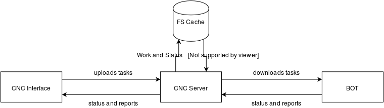

# INT-WAW

Boilerplate fuer das Projekt. Dieses Projekt muss geforked werden,
Meilensteinabgabe wird realisiert via Pull Request.

Pull Requests dienen hierbei der Bewertung, Abnahme und dem
Auffinden von Plagiaten. Meilensteine sind zudem in der
[Meilensteinuebersicht](https://github.com/INT-WAW/Boilerplate/milestones)
einsehbar. Diese werden bei Bekanntgabe im Kurs angepasst, so dass
jeder auf dem gleichen Informationsstand ist.

# Testate

Es gibt 2 Testate. Zulassung zum Testat haben nur Projekte, die am
jeweiligen Montag vorher (d.h. Montag, 12:00 Uhr mittags) einen
Pull-Request auf dieses Projekt mit ihrem entwickelten Inhalt
gestellt haben.

Alle Gruppen, die dies nicht erfuellt haben, werden nicht zum Testat
zugelassen. Es gibt keine Ausnahmen.

## Testat am 04.05.2016

Geprueft und abgenommen werden Meilenstein 1 und 2.

## Testat am 15.06.2016

Geprueft und abgenommen werden Meilenstein 3 und 4.

# Uebersicht

# Meilensteine

Fuer die erfolgreiche Bewertung des Projekts
sind die Erfuellung der folgenden Meilensteine
notwendig.

Studienleistung des INT-WAW Kurses ist erbracht
bei Antreten des ersten Meilensteins.

## Meilenstein 1 (Beginn 23.03.2016)

- Verstaendnis von Git, GitHub, Branches, Triangularer Workflow
- Pull-Request auf dieses Projekt mit Teamname im Issue und alle Mitglieder haben schon einmal commited.
- Interface: Status Tabelle Bots (Workload, IP, Auftrag, Pause/Resume/Stop Buttons)
- Interface: Sidebar-Menu (Status, Auftrag, Bots)
- Interface: GET integration zu CNC Server (/api/Status)

## Meilenstein 2

- Interface: Detailansicht Auftrag (Bearbeiten, Loeschen)
- Interface: Auftrag Formular
- Interface: POST integration zu CNC Server (/api/Task)

## Meilenstein 3

- node.js CNC: Implementierung mit ES6 und [KOA.js](https://github.com/koajs/koa)
- GET API fuer /api/Status (Interface &lt;= CNC, Status von Bots)
- POST API fuer /api/Status (BOT =&gt; CNC, Registrierung von Bots)
- GET API fuer /api/Task (Bot &lt;= CNC, Abnahme von Arbeit)
- POST API fuer /api/Task (Interface =&gt; CNC, Erstellen von Arbeit)
- DELETE API fuer /api/Task (Interface =&gt; CNC, Loeschen von Arbeit)
- GET API fuer /api/Report (Interface &lt;= CNC, Abnahme von Report)
- POST API fuer /api/Report (BOT =&gt; CNC, Erstellen von Report)
- Verwaltung der momentanen Status, Tasks und Reports in Filesystem-Cache Dateien

## Meilenstein 4

- Interface: WebSocket integration
- CNC: WebSocket integration
- BOT: GET / POST integration, WebSocket integration und Bearbeitung der Tasks

# Terminologie

## CNC Interface (kurz: Interface)

Das CNC Interface ist eine lokale HTML5 Applikation. Es dient zur
Kontrolle der Bots via deren CNC Server. Typischerweise ist diese
lokale Applikation dafuer ausgelegt, mehrere (n) Server und mehrere
(n * n) Bots zu kontrollieren und zu verwalten.

Den notwendigen Exploiting-Aspekt und wie diese Bots in der Regel
auf Rechner gelangen ignorieren wir in dieser Vorlesung. In der
Projektabnahme (Testate) werden mehrere Bots (ca. 100 - 200, davon
ca. 2 lokal) zur Verfuegung sein, um das Projekt zu testen.

## CNC Server (kurz: CNC)

Der CNC Server ist der sogenannte Command and Control Server. Dieser
Server kontrolliert eine ihm bekannte Menge an Bots, welche sich, bei
Aktivierung bzw. Ausfuehrung, registrieren.

Sinn des CNC Servers ist die intelligente Aufgabenverteilung fuer
potenzielle Ausfaelle von Bots. Dementsprechend sollen Aufgaben
redundant verteilt und bearbeitet werden, um die Auswertung dahinter
zu ueberpruefen und bei Kalkulationen den Mittelwert der Reports
(Resultate) zu errechnen.

## Bot (kurz: BOT)

Ein Bot ist in unserem Fall ein stumpfes Programm, welches zur
Ausgliederung von Arbeit (Workload) einer zentralen Architektur
verwendet wird. Dies kann z.B. rechenintensive Arbeit, wie z.B. das
Berechnen von Hashes oder das Bruteforcen von Kennwoerten zu ihren
Hashes sein.

In der Projektabnahme (Testate) werden diese Bots mit dem letzten
Verfuegbaren Stable Release von [node.js](https://nodejs.org)
bestueckt sein.

# Spezifikationen

## Meilenstein 1

Up to come ...

# Organisation

Alle organisatorischen Aufgaben, Probleme und Fragen finden
in dem Repository [https://github.com/INT-WAW/Organization](https://github.com/INT-WAW/Organization)
statt.

